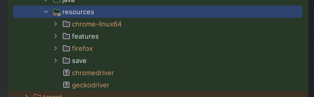
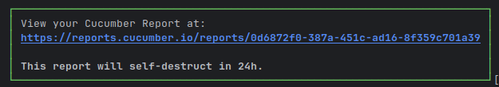

# SaucedemoFramework

## Usage Guide for Linux

After cloning the project, run the build for `pom.xml`. All necessary libraries have already been prepared.

### Setup Browsers and Drivers

Extract the folder containing compatible browsers and drivers from:

[Download Browsers & Drivers](https://drive.google.com/file/d/1fqJZh4_g90N0JZ9IfM428QOJ5wqxCiip/view?usp=sharing)

Copy all browsers and drivers into the `resource` folder:


### Running Tests

- **Chrome:**
```bash
mvn clean test -P chrome
```
 **firefox:**  
```bash
mvn clean test -P firefox
```
 **parallel-browsers:**  
```bash
mvn clean test -P parallel-browsers
```
Test Reports

You can view the test reports here in your logs:
